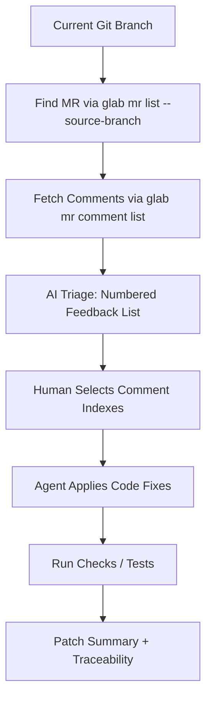

# GitLab MR Review Agent for Codex

  
  


An AI-first Codex plugin that transforms GitLab Merge Request (MR) feedback into an **agentic fix workflow**.

It automatically discovers the MR for your current branch, retrieves review comments, allows selective fixing, and provides a clear audit trail of applied changes.

---

## Why This Exists

Code review feedback is typically fragmented across:
- Inline comments  
- General discussions  
- System notes  

This plugin creates a focused remediation loop:

1. Discover MR from current branch  
2. Pull review comments with context  
3. Prioritize comments to fix  
4. Apply code changes  
5. Summarize changes with traceability  

---

## What It Does

- Resolves MR from current branch using `glab`
- Fetches MR discussions/comments in JSON
- Produces a numbered list for easy selection
- Supports filtering (`unresolved`, `resolved`, `all`)
- Enables agentic workflow: **select → fix → verify → summarize**
- Works with Codex local/personal marketplace plugins

---

## Agent Workflow



---

## Project Structure

```
.
├── plugins/
│   └── gitlab-mr-review/
│       ├── .codex-plugin/
│       │   └── plugin.json
│       ├── scripts/
│       │   ├── current_branch_mr_comments.sh
│       │   └── fetch_mr_review.sh
│       ├── skills/
│       │   └── gitlab-mr-review/
│       │       └── SKILL.md
│       └── README.md
└── .agents/
    └── plugins/
        └── marketplace.json
```

---

## Prerequisites

- Codex plugin support enabled  
- `glab` installed and authenticated  
- `git` installed  
- `python3` available  
- Access to target GitLab repository  

### Verify GitLab Auth

```bash
glab auth status
```

---

## Installation

### Add Marketplace Repository

```bash
codex plugin marketplace add <Arunashokvt>/<codex>
```

Or via URL:

```bash
codex plugin marketplace add https://github.com/Arunashokvt/codex.git
```

### Install Plugin

1. Restart Codex  
2. Navigate to `/plugins`  
3. Install **GitLab MR Review**

---

## Quick Start

### 1. Fetch MR Comments for Current Branch

```bash
cd plugins/gitlab-mr-review
./scripts/current_branch_mr_comments.sh --state unresolved
```

### 2. Select Comments to Fix

```bash
./scripts/current_branch_mr_comments.sh --select 1,3,5
```

### 3. Run Agentic Flow in Codex

```
Use gitlab-mr-review: fetch unresolved MR comments for my current branch, show numbered list, and ask me which ones to fix.
```

Then:

```
Fix comments 1,3,5. Update code and summarize each fix.
```

---

## Script Reference

### `current_branch_mr_comments.sh`

**Purpose:**
- Resolve branch → MR
- Collect MR comments
- Provide numbered selection interface

**Common Flags:**

```bash
--state all|resolved|unresolved
--mr-index <n>
--select 1,2,3
--output-file <path>
```

---

### `fetch_mr_review.sh`

**Purpose:**
- Fetch MR data directly (URL or project + IID)
- Return MR metadata, discussions, and notes (JSON)

**Common Flags:**

```bash
--mr-url <url>
--project <group/project> --iid <iid>
--hostname <gitlab-host>
--no-discussions
--no-notes
```

---

## Summary

This plugin converts GitLab MR reviews into a structured, AI-assisted remediation pipeline. Instead of manually parsing feedback, you get:

- Deterministic selection  
- Controlled fixes  
- Traceable changes  
- Faster iteration cycles  